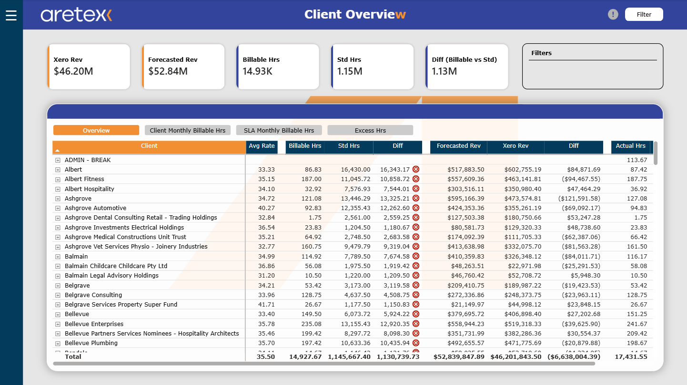
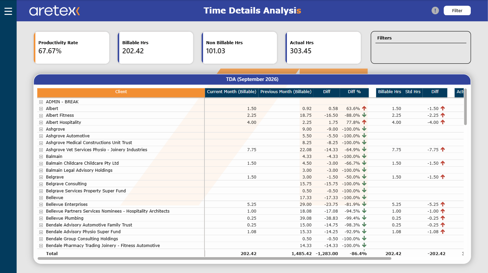
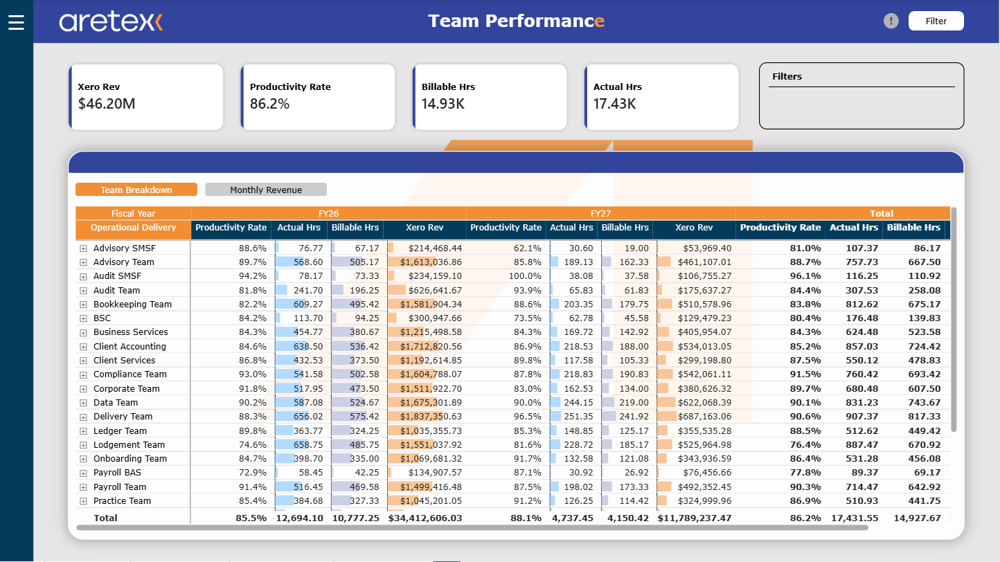
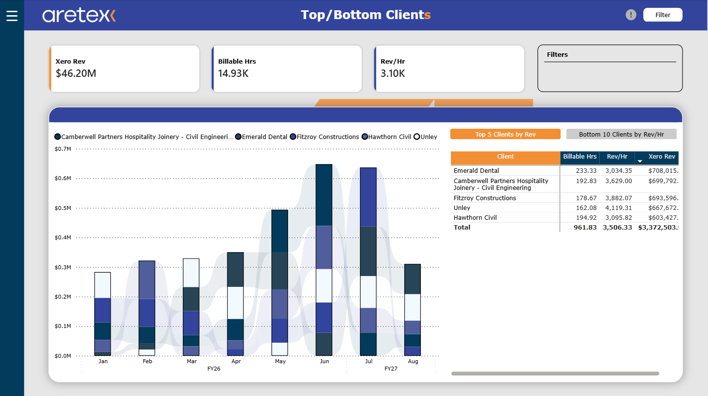

# WIP — Power BI Semantic Model & Report

A production-scale Power BI project for tracking work-in-progress delivery across an accounting practice: billable vs non-billable hours, team utilisation, client revenue variance, and month-over-month productivity.

Published as a **Power BI Project (PBIP)** rather than a `.pbix`, so the semantic model (TMDL) and report definition (PBIR) are both plain text — reviewable, diffable, and version-controlled.

> ### All data in this repository is synthetic
> Every client name, employee name, activity log and revenue figure is fabricated. The model was originally built against live SharePoint sources; those connections have been removed and replaced with a generated workbook. See [Synthetic data](#synthetic-data) for how it was produced and why it still behaves like the real thing.

---

## Screenshots

| | |
|---|---|
|  |  |
| **Client Overview** | **Time Details Analysis** |
|  |  |
| **Team Performance** | **Top/Bottom Clients** |

> All figures shown are synthetic. See [Synthetic data](#synthetic-data).

---

## Report pages

| # | Page | Purpose |
|---|------|---------|
| 1 | **What's New** | Release notes feed, driven by the `release_notes` table so the changelog is data rather than a text box |
| 2 | **Client Overview** | Per-client hours, revenue and variance, sliceable by business stream and principal |
| 3 | **Top/Bottom Clients** | Ranked client performance with configurable N |
| 4 | **Time Details Analysis** | Current vs previous month productivity, billable/non-billable split, break exclusion |
| 5 | **Team Performance** | Team and STL rollups, utilisation against standard hours |
| 6 | **Other Reports** | Operational extracts and drill-through targets |

---

## Data model

A star schema with two fact tables sharing a common date and client dimension.

```
                      ┌──────────────┐
                      │   dim_date   │  (calculated, CALENDARAUTO from 2025-01-01)
                      │   [Date]     │  fiscal year Jul–Jun
                      └──────┬───────┘
                     ┌───────┴────────┐
                     │                │
            ┌────────▼────────┐  ┌────▼──────────────┐
            │ fact_activities │  │ fact_client_data  │
            │  activity logs  │  │ weekly snapshots  │
            │  ~11.3k rows    │  │  ~10.8k rows      │
            └────────┬────────┘  └────┬──────────────┘
                     │                │
                     │  ┌─────────────▼──┐
                     └──►  dim_clients   │  636 rows
                        │ [TC Reference*]│  incl. 4 internal codes
                        │ [tcref_bs_id]  │
                        └────────────────┘

            ┌───────────────┐      ┌─────────────┐
            │ release_notes │      │  yesterday  │  (single-value helper)
            └───────────────┘      └─────────────┘

            _Measures  — 30 measures, no data columns
```

**Relationships**

| From | To | Notes |
|------|----|-------|
| `fact_activities[date]` | `dim_date[Date]` | active |
| `fact_client_data[Date]` | `dim_date[Date]` | active |
| `fact_client_data[tcref_bs_id]` | `dim_clients[tcref_bs_id]` | composite client + business stream key |
| `fact_activities[tcRef]` | `dim_clients[TC Reference*]` | |
| `fact_client_data[Name of Clients (TC Reference)]` | `fact_activities[tcRef]` | many-to-many |

Full column reference: [`docs/DATA_DICTIONARY.md`](docs/DATA_DICTIONARY.md)
Measure reference: [`docs/MEASURES.md`](docs/MEASURES.md)

---

## Things worth looking at

**`Duration (Hrs)`** — degrades gracefully through three sources rather than assuming one is populated:

```dax
SUMX(
    fact_activities,
    IF(
        ISBLANK(fact_activities[leaveHours]),
        IF(
            ISBLANK(fact_activities[hours]),
            MOD(fact_activities[endTime] - fact_activities[startTime], 1) * 24,
            fact_activities[hours]
        ),
        fact_activities[leaveHours]
    )
)
```

The `MOD(..., 1)` handles activities that cross midnight — a naive subtraction returns a negative duration for a log that starts at 22:00 and ends at 01:00.

**`Category for Productivity Page`** — a calculated column that classifies each activity by activity code first, falling back to SLA:

```dax
VAR SLA_Category =
    SWITCH(TRUE(),
        'fact_activities'[SLA] = "Operations", "Operations",
        'fact_activities'[SLA] = "Admin", "Admin",
        'fact_activities'[SLA] = "Workforce Experience", "Workforce Experience",
        "Net Billable Hours")
RETURN
    SWITCH(TRUE(),
        'fact_activities'[tcRef] = "ADMIN - BREAK", "Break",
        'fact_activities'[tcRef] = "UNCHARGEABLE HRS", "Unchargeable Hours",
        'fact_activities'[tcRef] IN { "LEAVE", "SICK LEAVE" }, "Leave",
        SLA_Category)
```

**`Show Filters`** — reconstructs the active slicer state as text for export headers, using `ISFILTERED` + `CONCATENATEX` so a printed page states what it was filtered to.

---

## Synthetic data

`Synthetic_Data.xlsx` holds four sheets matching the four imported tables. It was produced by [`tools/generate_synthetic_data.py`](tools/generate_synthetic_data.py), which profiles a seed extract and samples from the distributions it finds rather than generating uniform noise.

| Sheet | Rows | Grain |
|-------|------|-------|
| `fact_activities` | 11,265 | one row per logged activity, weekdays 2026-01-01 → 2026-09-03 |
| `fact_client_data` | 10,816 | weekly Friday snapshot per client + business stream |
| `dim_clients` | 636 | client master, incl. 4 internal non-billable codes |
| `release_notes` | 14 | changelog entries, v1.8 → v2.5 |

What the generator preserves, and why it matters:

- **Functional dependencies.** `userName` determines `userId`/`teamName`/`stlName`; `tcRef` determines `clientName`/`Xero Name`. Both are 1:1 in the seed and stay 1:1, so no visual gains a phantom row.
- **Joint distributions.** `Rates` and `Standard Hours` are drawn as a *pair* from combinations that actually co-occur. Sampling them independently is the obvious approach and it's wrong — the top rate meeting the top hours pushes `Forecasted Revenue` to 312k against a real ceiling of 30k.
- **Column sparsity.** The four `fact_client_data` measures stay at their observed fill rates (62% / 66% / 48% / 62%) instead of being fully populated, and `Forecasted Revenue` equals `Rates × Standard Hours` wherever both exist.
- **Seasonality.** A quiet January, BAS-lodgement humps in late February and late April, the Australian financial-year-end peak across May–July, and a post-EOFY August dip.
- **Non-billable activity.** ~10% of rows are `LEAVE`, `SICK LEAVE`, `ADMIN - BREAK` or `UNCHARGEABLE HRS`, plus a 3% slice of billable rows carrying Admin/Operations/Workforce Experience SLAs. Without these, six of the seven branches in `Category for Productivity Page` are unreachable and the Productivity page can only render billable hours.
- **Referential integrity.** Every generated `tcRef` and `tcref_bs_id` resolves to a `dim_clients` row, so no blank members appear on either relationship.

The generator is seeded, so re-running reproduces the committed workbook.

---

## Running this locally

**Requirements** — Power BI Desktop (2024-02 or later, for PBIP + TMDL), with *Power BI Project (.pbip) save option* and *store semantic model using TMDL* enabled under **File → Options → Preview features**.

1. Clone the repository.
2. Open `WIP.pbip`.
3. Set the data path — the workbook is referenced through a parameter rather than an absolute path:

   **Home → Transform data → Manage parameters → `SyntheticDataPath`**

   Set it to the full path of `Synthetic_Data.xlsx` in your clone, e.g. `D:\repos\wip\Synthetic_Data.xlsx`.

   > Power Query cannot resolve paths relative to the project folder, so this one value has to be set per machine. It is the only local configuration required.

4. **Refresh**.

`RangeStart` / `RangeEnd` are retained for incremental refresh and are not currently consumed by any partition.

---

## Repository layout

```
├── WIP.pbip                            # project entry point
├── WIP.SemanticModel/
│   └── definition/
│       ├── model.tmdl                  # model, query groups, table refs
│       ├── relationships.tmdl
│       ├── expressions.tmdl            # SyntheticDataPath, RangeStart/End
│       ├── cultures/en-PH.tmdl         # Q&A linguistic schema
│       └── tables/                     # one TMDL file per table
├── WIP.Report/
│   ├── definition/
│   │   ├── pages/                      # one folder per page, per-visual JSON
│   │   ├── bookmarks/                  # 74 bookmarks
│   │   └── report.json
│   └── StaticResources/                # theme + image assets
├── Synthetic_Data.xlsx                 # generated source workbook
├── tools/
│   └── generate_synthetic_data.py
├── docs/
│   ├── DATA_DICTIONARY.md
│   ├── MEASURES.md
│   └── screenshots/
├── .gitattributes
├── .gitignore
└── LICENSE
```

Deliberately not tracked: `.pbi/cache.abf` (materialised model cache — large, binary, and a copy of whatever was last refreshed) and `.pbi/localSettings.json` (workspace GUIDs and an encrypted credential-binding signature).

---

## Tech

Power BI Desktop · TMDL · PBIR · DAX · Power Query (M) · Python (openpyxl)

## License

[MIT](LICENSE) for the code and model definition.
